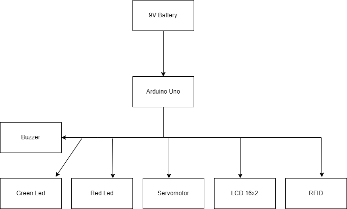
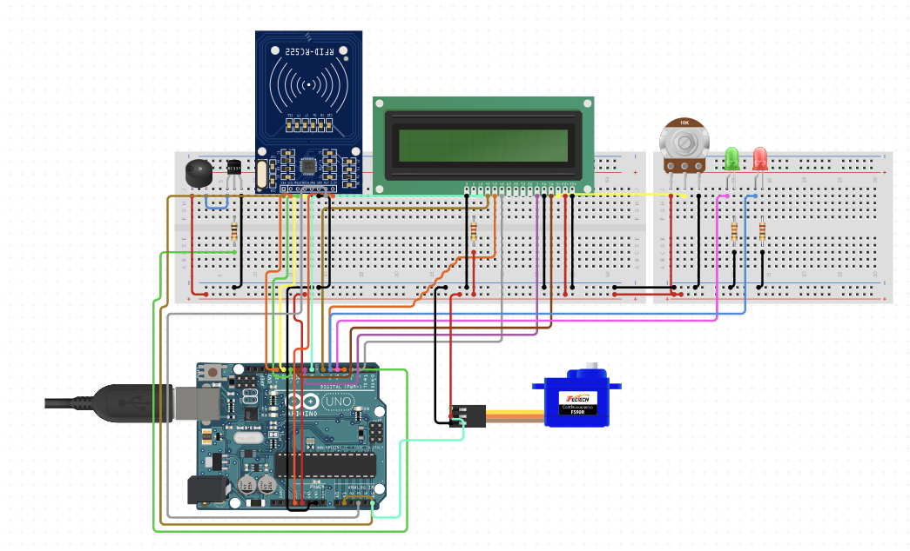

# Smart Look Door

| | |
|-|-|
|`Author` | Lucaci Andrei

## Description
This device is designed to simulate a smart door lock. We'll be able to unlock the door using a pin code or fingerprint, so we won't need the classic key.
## Motivation
The opportunity to learn to create my own home security.
## Architecture

### Block diagram
<!-- Make sure the path to the picture is correct -->

### Schematic

### Components

<!-- This is just an example, fill in with your actual components -->

| Device | Usage | Price |
|--------|--------|-------|
| Activ Buzzer | Buzzer | [1.5 RON](https://www.optimusdigital.ro/ro/audio-buzzere/635-buzzer-activ-de-3-v.html?search_query=buzzer&results=61) |
| Jumper Wires | Connecting components | [7 RON](https://www.optimusdigital.ro/ro/fire-fire-mufate/884-set-fire-tata-tata-40p-10-cm.html?search_query=set+fire&results=110) |
| Breadboard | Project board | [10 RON](https://www.optimusdigital.ro/ro/prototipare-breadboard-uri/8-breadboard-830-points.html?search_query=breadboard&results=145) |
| 16x2 LCD display with I²C interface | Info display | [30 RON](https://store.arduino.cc/collections/displays/products/16x2-lcd-display-with-i-c-interface ) |
| MODUL RFID 13.56MHZ | Card reading | [11.8 RON](https://www.sigmanortec.ro/Kit-modul-RFID-13-56-MHz-p126025377?gad_source=1&gclid=Cj0KCQjwjLGyBhCYARIsAPqTz18LWiDwGaMFjVTZniWFx9gv3Hh_ozjOWzKwP1SwneKKpDnOLNUtl0kaApdwEALw_wcB)|
| SERVOMOTOR | Ballast wheel | [11.9 RON](https://www.sigmanortec.ro/servomotor-sg90-360-continuu?gad_source=1&gclid=Cj0KCQjwjLGyBhCYARIsAPqTz1-SNU06CsBVtA3Jff7EA74GCB5rnUIZ3BLSMQjVzX2o3lRudlJyNQAaAtq9EALw_wcB)|
| LED | Check permission | [1.02 RON](https://ardushop.ro/ro/electronica/79-led-3mm.html?gad_source=1&gclid=Cj0KCQjwjLGyBhCYARIsAPqTz19fjegVCgRzKlJO_b5aG2R7s7mcEpGa-pWjk67icC5gkQeQUxqvC5IaAj0OEALw_wcB)|

### Libraries

<!-- This is just an example, fill in the table with your actual components -->

| Library | Description | Usage |
|---------|-------------|-------|
| [SPI.h](https://www.arduino.cc/reference/en/language/functions/communication/spi/) |This library allows you to communicate with SPI devices, with the Arduino as the controller device. This library is bundled with every Arduino platform (avr, megaavr, mbed, samd, sam, arc32), so you do not need to install the library separately. | Allows you to communicate with SPI devices  |
| [MFRC522.h](https://www.arduino.cc/reference/en/libraries/mfrc522/) | Arduino RFID Library for MFRC522 (SPI). Read/Write a RFID Card or Tag using the ISO/IEC 14443A/MIFARE interface. | Read/Write a RFID Card  |
| [LiquidCrystal.h](https://www.arduino.cc/reference/en/libraries/liquidcrystal/) | Allows communication with alphanumerical liquid crystal displays (LCDs). This library allows an Arduino/Genuino board to control LiquidCrystal displays (LCDs) based on the Hitachi HD44780 (or a compatible) chipset, which is found on most text-based LCDs. The library works with in either 4 or 8 bit mode (i.e. using 4 or 8 data lines in addition to the rs, enable, and, optionally, the rw control lines). | Posibility to use the LCD  |
| [Servo.h](https://www.arduino.cc/reference/en/libraries/servo/) | Allows Arduino boards to control a variety of servo motors. This library can control a great number of servos. It makes careful use of timers: the library can control 12 servos using only 1 timer. On the Arduino Due you can control up to 60 servos. |Used for servomotor use |

## Log

<!-- write every week your progress here -->

### Week 6 - 12 May

### Week 7 - 19 May

### Week 20 - 26 May

## Reference links

<!-- Fill in with appropriate links and link titles -->

[Tutorial 1](https://www.youtube.com/watch?v=wdgULBpRoXk&t=1s&ab_channel=BenEater)

[Article 1](https://www.explainthatstuff.com/induction-motors.html)

[Link title](https://projecthub.arduino.cc/)